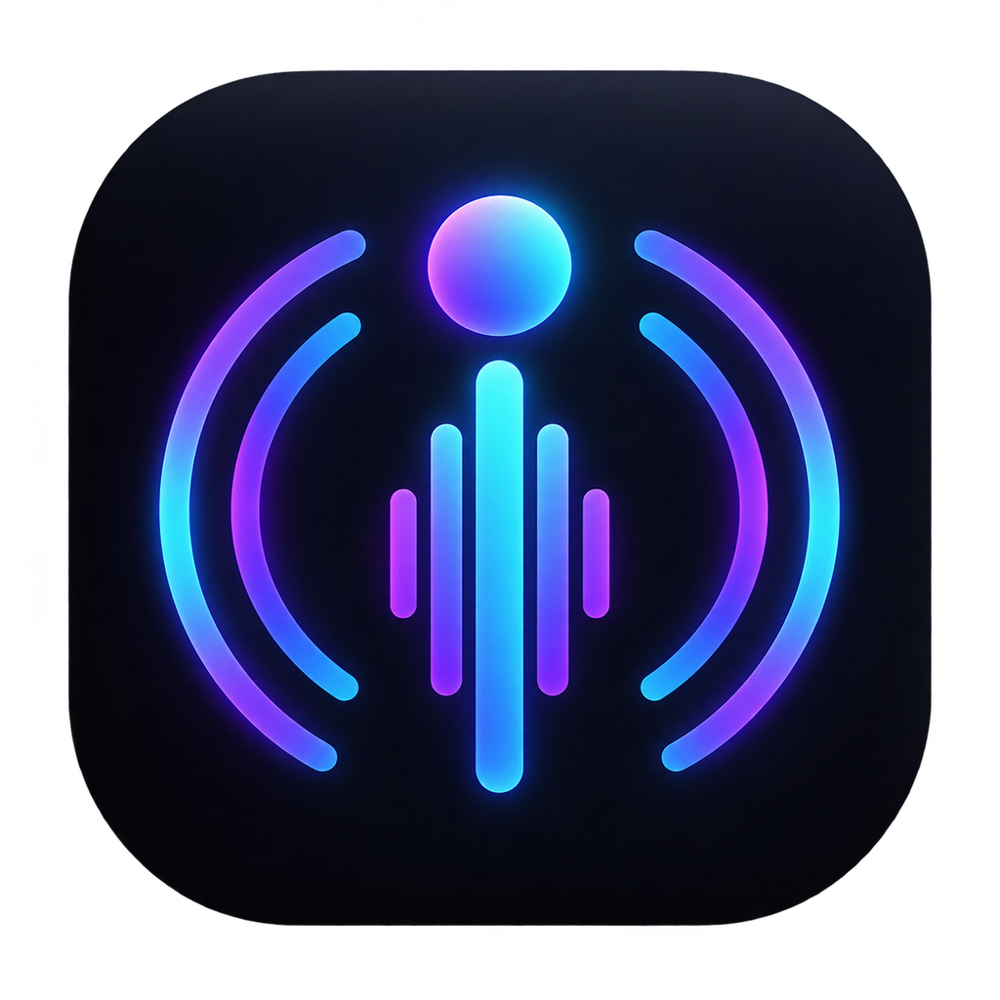
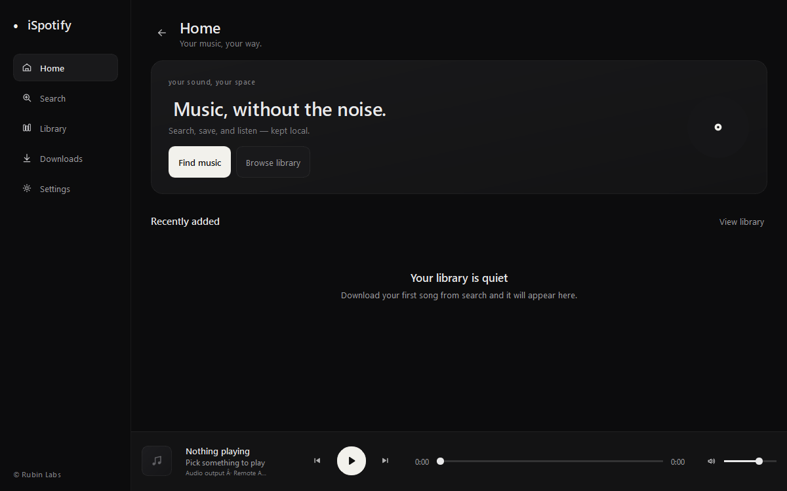
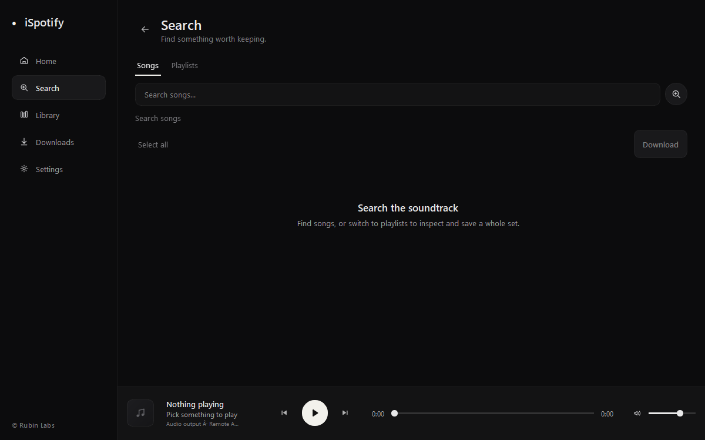
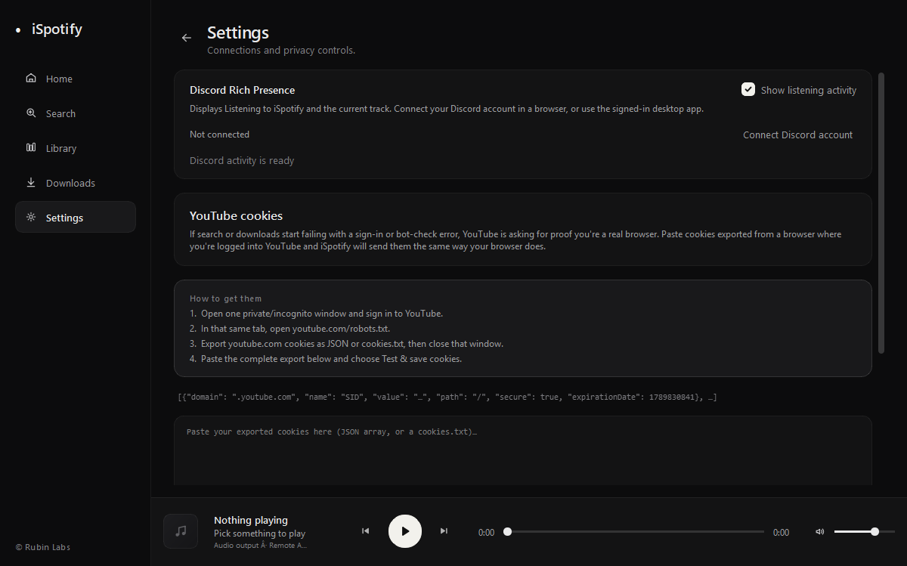

<div align="center">
  

# iSpotify

### Search, download, and play your music on Windows and Linux

[](https://github.com/RubinLabs26/ISpotify/releases/latest)
[](https://github.com/RubinLabs26/ISpotify/releases)
[](https://github.com/RubinLabs26/ISpotify/stargazers)
[](LICENSE)
[](https://github.com/RubinLabs26/ISpotify/actions/workflows/checks.yml)

[Download](#download) · [Features](#features) · [Build from source](#build-from-source) · [Contribute](#contributing)

</div>

> [!NOTE]
> iSpotify is local-first. It has no iSpotify account, project-operated server,
> analytics, or telemetry. Your library, playlists, cookies, and credentials
> stay in your operating system's user-data storage.

## Screenshots

<div align="center">
  
  
  <br>
  
</div>

## Features

| | |
|---|---|
| **Search and discovery**<br>Search for songs and playlists, explore playlist tracks, and select multiple items for download. | **Playback**<br>Play local MP3 files sequentially from your library with previous/next, seek, volume, and automatic pause when headphones disconnect. |
| **Downloads and library**<br>Queue MP3 downloads across restarts with speed, ETA, and retry guidance; search and sort your library, favorite songs, and organize playlists for offline listening. | **Privacy and integrations**<br>Use optional local YouTube cookies and Discord listening activity with cover art, playback time, and listening/download links. Credentials stay in the operating system vault. |
| **Desktop experience**<br>Keep favorites and recently played at hand, with quiet background update checks. | **Flexible installation**<br>Choose a Windows installer, portable executable, Debian package, Linux repository, or universal installer. Supported builds can install updates in-app and prompt for restart. |

## Download

The current stable release is **v19.4.0**. Checksums are published beside the standalone executables.

| Platform | Package | Download |
|---|---|---|
| Windows 10/11 | Installer | [ISpotify-Setup-x86_64.exe](https://github.com/RubinLabs26/ISpotify/releases/latest/download/ISpotify-Setup-x86_64.exe) |
| Windows 10/11 | Portable | [ISpotify-windows-x86_64.exe](https://github.com/RubinLabs26/ISpotify/releases/latest/download/ISpotify-windows-x86_64.exe) |
| Debian / Ubuntu | DEB package | [ispotify_19.4.0_amd64.deb](https://github.com/RubinLabs26/ISpotify/releases/download/v19.4.0/ispotify_19.4.0_amd64.deb) |
| Linux x86-64 | Portable | [ISpotify-linux-x86_64](https://github.com/RubinLabs26/ISpotify/releases/latest/download/ISpotify-linux-x86_64) |
| All packages | Release page | [Latest release](https://github.com/RubinLabs26/ISpotify/releases/latest) |

### Linux installer

```bash
curl -fsSL https://raw.githubusercontent.com/RubinLabs26/ISpotify/main/packaging/install-linux.sh | bash
```

The installer checks your system, detects `apt`, `dnf`, `yum`, `pacman`,
`zypper`, `apk`, `xbps`, or `emerge`, and installs aria2 for fast resumable
downloads with live progress and speed. It can add the signed APT or pacman
repository where supported and falls back to a portable user installation on
other compatible glibc systems.

Run it with `--check` to inspect compatibility without installing. Other useful
options include `--repo`, `--standalone`, `--force`, `--yes`, and `--uninstall`.
The portable Linux build requires x86-64 and glibc 2.36 or newer.

## Discord activity

Discord integration is optional. If the Discord desktop app is running,
iSpotify can publish **Listening to iSpotify** and the current track. Browser
users can choose **Connect Discord account** in Settings and authorize through
Discord's official login page. The authorization link can be opened again or
copied when a browser cannot be launched automatically. iSpotify never asks for
a password, bot token, or raw user token.

The official release packages include the Discord Social SDK runtime. Discord's
distribution terms do not permit publishing its raw proprietary library in this
source repository, so source checkouts run without account login unless an
authorized SDK runtime is supplied locally.

## Build from source

Python 3.10 or newer is required.

```bash
git clone https://github.com/RubinLabs26/ISpotify.git
cd ISpotify
python -m venv .venv
python -m pip install -r requirements.txt
python main.py
```

FFmpeg is used from `PATH` when available; `imageio-ffmpeg` provides a fallback.
Deno or Node.js is recommended for YouTube JavaScript challenges.

## FAQ

<details>
<summary><strong>Do I need an account?</strong></summary>

No iSpotify account is required. Discord authorization is optional and only
enables listening activity.

</details>

<details>
<summary><strong>Why can a download ask for YouTube cookies?</strong></summary>

YouTube sometimes requires sign-in or bot verification. In Settings, you can
import a Netscape cookie file or paste a Cookie-Editor JSON export. Treat an
exported cookie file like a password and never share or commit it.

</details>

<details>
<summary><strong>Where is my data stored?</strong></summary>

iSpotify keeps downloads and application data in your operating system's user
data folders. The Linux installer keeps interrupted package downloads in
`~/.cache/ispotify/downloads` so aria2 can resume them.

</details>

<details>
<summary><strong>Does iSpotify use a download server?</strong></summary>

No. Search, extraction, downloading, playback, and library management run on
your computer.

</details>

## Built with

| Project | Purpose |
|---|---|
| [PySide6](https://doc.qt.io/qtforpython-6/) | Cross-platform desktop interface |
| [yt-dlp](https://github.com/yt-dlp/yt-dlp) | Media discovery and extraction |
| [FFmpeg](https://ffmpeg.org/) | Audio conversion |
| [Discord Social SDK](https://discord.com/developers/docs/discord-social-sdk/overview) | Optional browser account authorization and activity |
| [keyring](https://github.com/jaraco/keyring) | Operating-system credential storage |

## Contributing

Bug reports, documentation fixes, and code contributions are welcome. Read
[CONTRIBUTING.md](CONTRIBUTING.md) before opening a pull request, and report
sensitive security issues using [SECURITY.md](SECURITY.md).

<div align="center">

[](https://github.com/RubinLabs26/ISpotify/graphs/contributors)

Project contributor: [@rubinbastakoti](https://github.com/rubinbastakoti)

Licensed under the [MIT License](LICENSE).

---

**iSpotify is an independent project from Rubin Labs and its contributors.**

It is not affiliated with or endorsed by Spotify AB, YouTube, Google, or
Discord. Product names and trademarks belong to their respective owners.

</div>
